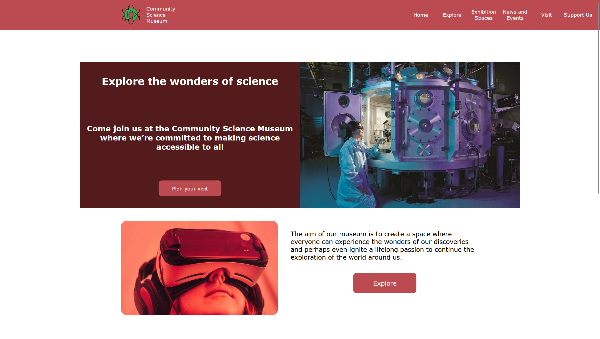

# Community Science Museum -Semester Project-1



## Description

THe community science museum website was my semester project 1 submission during my first year on noroff,
Here we were tasked to create a website with 4-6 pages that appeals to the target audience.

The website consists of these pages:

- index.html (home page)
- lexplore.html (an explore site for either kids,teacher or researchers to see what oppurtunitiest CSM is offering them,)
- exhibitionspaces.html (Page that shows and describes the different exhibition spaces CSM is offering )
- news-and-events.html (status page on diffrentes events CSM is arranging)
- visit.html(information on how to reach out to CSM)
- support.html(page fo rusers to support th emusum trough donations an volunterring)

## Built With

- [HTML 5](https://developer.mozilla.org/en-US/docs/Web/HTML)
- [CSS](https://developer.mozilla.org/en-US/docs/Web/CSS)

- Domain is hosted on one.com and wordpress for the API hosting. Wordpress is setup as headless mode with all the movies hosted in the API.

## Getting Started

### Installing

1. Clone the repo:

```bash
git clone https://github.com/Noroff-Anders/ca_cms_anders-nes.git
```

2. Install the dependencies:

No need to install any dependencies for this project. Project consists of only HTML and CSS

### Running

Project is hosted on netlify:  https://neon-nougat-c698ac.netlify.app/
When repo is cloned you can use liverserver extension to have the website hosted locally on your computer.

## Contributing

This is a school project so no contributions are accepted.

## Contact

- [ My LinkedIn page](https://www.linkedin.com/feed/)

- Email: anders.nes98@gmail.com

## Acknowledgments

[Noroff project modules](https://lms.noroff.no/my/)